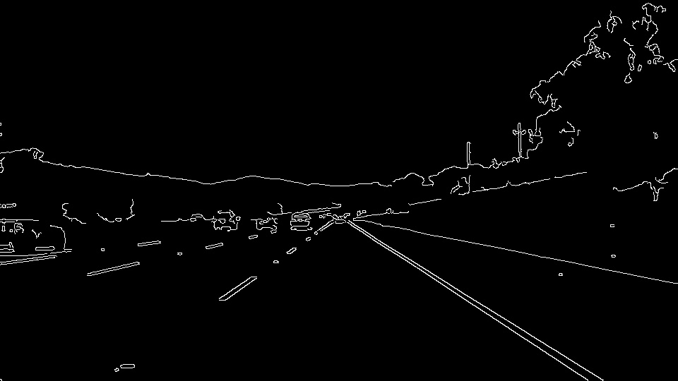

# **Finding Lane Lines on the Road**

## Project Writeup

---

**Finding Lane Lines on the Road**

The goals / steps of this project are the following:
* Make a pipeline that finds lane lines on the road
* Reflect on my work in a written report

[//]: # (Image References)

[image1]: ./examples/grayscale.jpg "Grayscale"

---

### Reflection

Overview
---

When we drive, we use our eyes to decide where to go.  The lines on the road that show us where the lanes are act as our constant reference for where to steer the vehicle.  Naturally, one of the first things we would like to do in developing a self-driving car is to automatically detect lane lines using an algorithm.

In this project you will detect lane lines in images using Python and OpenCV.  OpenCV means "Open-Source Computer Vision", which is a package that has many useful tools for analyzing images.  

### 1. This project is about implementing an image pipeline to detect street's lane lines.

My pipeline consisted of 6 steps:

1 - Read the image pixels for which you need to detect the lane lines.

2 - Convert the read image from RGB image to grayscale using cv2.cvtColor

3 - Apply Canny edge detection with kernel (5x5) to get the gradient image.

4 - Create a mask image with a polygon of 4 vertices to zero out region out of interest so that only the region of interest appears in the masked image

5 - Apply Hough transform on the masked image to find the lines detected in the image and draw those lines on the image.

6 - Combine the lines drawn on top of the input (RGB) image using cv2.addWeighted to get the final image.

Note : In order to draw lines on the left and right lanes, I modified the draw_lines() function and extrapolate the line by calculating the slope and intercept of the lines obtained from hough transformation.

### 2. Potential shortcomings with your current pipeline

In a single frame of the video, there may be no edges/points in the region of interest that qualify to be a detected line so there is no lines to draw on the image

Another possible shortcoming is if I have a curved lane, the current code is not handling this case.

### 3. Possible improvements to my pipeline

In the above explained issue, If this frame happened in the middle of the video, I keep the previous slope and intercept and assume the line will be of the same slope and intercept, which is logical as the probability of a lane suddenly changing the slope in few frames is very low.

But if this issue happens at the beginning of the video, I do not draw any lines and wait until we have an average "trusted" slope and intercept for the data we captured from hough transformation of previous frames in the video.

For curved lines, I think there might be another algorithm to draw curved lines and get the equation of their curvature instead of drawing straight lines.
